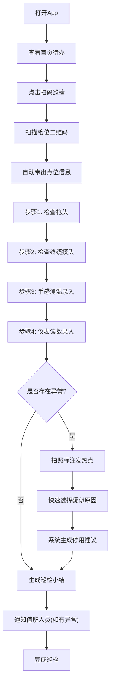
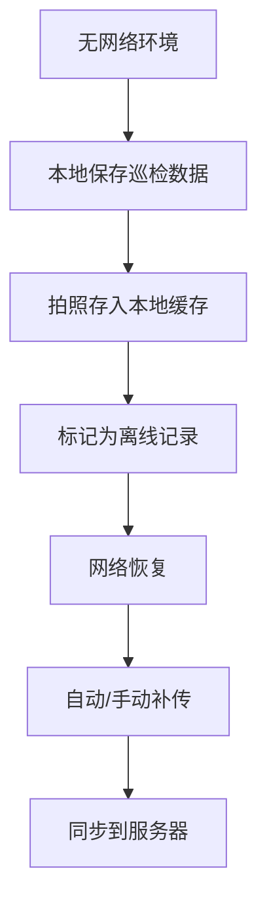

## 1. 产品概述

枪线温升排查移动App——专为现场巡检员设计的移动端巡检工具，将枪线温升排查流程数字化、标准化。解决传统纸质巡检效率低、判断标准不统一、异常记录不完整的问题，让一线人员几分钟内即可完成一次可靠的温升排查判断。

## 2. 核心功能

### 2.1 用户角色

| 角色 | 注册方式 | 核心权限 |
|------|----------|----------|
| 巡检员 | 工号登录 | 扫码巡检、异常上报、查看个人记录 |
| 值班人员 | 工号登录 | 接收异常通知、查看巡检汇总、审批停用建议 |

### 2.2 功能模块

1. **首页待办**：今日待巡检任务、超时预警、快捷入口、巡检进度
2. **扫码巡检**：扫码识别枪位、自动带出点位信息、按步骤引导检查流程
3. **异常拍照**：拍照标注发热点、支持多图上传、图片本地缓存
4. **现场判定**：录入手摸热感/仪表读数、快速选择疑似原因、停用建议生成、通知值班人员
5. **个人记录**：巡检历史列表、单次巡检小结、重复点位一键复查、离线补传状态

### 2.3 页面详情

| 页面名称 | 模块名称 | 功能描述 |
|----------|----------|----------|
| 首页待办 | 今日任务卡片 | 展示当日待巡检枪位列表、已完/未完成状态、超时红色标记 |
| 首页待办 | 巡检进度环 | 环形图展示今日完成率 |
| 首页待办 | 快捷操作栏 | 一键扫码、最近巡检、异常追踪快捷入口 |
| 扫码巡检 | 扫码区域 | 调用摄像头扫描枪位二维码，识别枪位编号 |
| 扫码巡检 | 点位信息卡 | 自动带出枪位编号、所属区域、线缆型号、上次巡检结果 |
| 扫码巡检 | 步骤引导 | 分步引导：①检查枪头 → ②检查线缆接头 → ③手感测温 → ④仪表读数 |
| 扫码巡检 | 枪头检查 | 外观检查项：氧化、变色、变形快速勾选 |
| 扫码巡检 | 线缆接头检查 | 接头检查项：松动、烧蚀、过热痕迹快速勾选 |
| 扫码巡检 | 手感测温录入 | 手摸热感等级选择：正常/温热/较烫/烫手 |
| 扫码巡检 | 仪表读数录入 | 温度数值输入、红外测温值、与标准值对比 |
| 异常拍照 | 拍照区域 | 调用摄像头拍照，支持多张连续拍摄 |
| 异常拍照 | 标注工具 | 在照片上标记发热点位置（圆圈/箭头标注） |
| 异常拍照 | 缩略图预览 | 已拍照片缩略图列表，支持删除和重拍 |
| 现场判定 | 疑似原因快选 | 预设原因列表：接触不良/过载/环境温度/线缆老化/其他 |
| 现场判定 | 停用建议 | 根据输入数据自动生成建议：继续使用/加强监控/立即停用 |
| 现场判定 | 通知值班 | 一键发送异常通知给值班人员，含点位和判定结果 |
| 现场判定 | 巡检小结 | 生成单次巡检摘要，含所有检查项结果和建议 |
| 个人记录 | 历史列表 | 按日期倒序展示巡检记录，支持按枪位筛选 |
| 个人记录 | 小结详情 | 单次巡检完整小结查看 |
| 个人记录 | 一键复查 | 对重复点位快速发起复查，自动带出上次数据 |
| 个人记录 | 离线状态 | 显示离线保存记录，网络恢复后一键补传 |

## 3. 核心流程

巡检员打开App → 首页查看今日待办 → 点击扫码巡检 → 扫描枪位二维码 → 自动带出点位信息 → 按步骤引导检查枪头 → 检查线缆接头 → 录入手感测温 → 录入仪表读数 → 发现异常时拍照标注 → 快速选择疑似原因 → 系统生成停用建议 → 确认后通知值班人员 → 生成巡检小结 → 完成巡检

离线流程：

## 4. 用户界面设计

### 4.1 设计风格

- **主色调**：工业深蓝 (#1B3A5C) + 安全警示橙 (#FF6B35)
- **辅助色**：正常绿 (#22C55E)、警告黄 (#F59E0B)、危险红 (#EF4444)
- **背景色**：深色模式为主 (#0F172A)，适配户外强光环境
- **按钮风格**：大触控区域圆角按钮（最小44px触控），3D微凸起效果
- **字体**：数字用等宽字体(DIN Alternate)，正文用思源黑体，大号加粗
- **布局**：底部Tab导航 + 卡片式内容，单手操作友好
- **图标风格**：线性+填充混合图标，安全相关的用填充强调

### 4.2 页面设计概览

| 页面名称 | 模块名称 | UI元素 |
|----------|----------|--------|
| 首页待办 | 今日任务卡片 | 深色背景、白色文字、左侧彩色状态条(绿/黄/红)、右滑标记完成 |
| 首页待办 | 巡检进度环 | 中心大号百分比数字、环形进度条、安全橙色渐变 |
| 首页待办 | 快捷操作栏 | 3个圆形大按钮、图标+文字、微光动画引导 |
| 扫码巡检 | 扫码区域 | 全屏摄像头、中央方形对焦框、橙色边框、扫描线动画 |
| 扫码巡检 | 点位信息卡 | 半透明卡片浮层、关键信息突出显示、上次结果彩色标签 |
| 扫码巡检 | 步骤引导 | 顶部步骤条(1-2-3-4)、当前步骤高亮、已完成步骤打勾 |
| 扫码巡检 | 枪头检查 | 多选标签式勾选、异常项变红高亮 |
| 扫码巡检 | 线缆接头检查 | 同枪头检查样式 |
| 扫码巡检 | 手感测温 | 4档大按钮选择(渐变色从绿到红)、选中态膨胀动画 |
| 扫码巡检 | 仪表读数 | 大号数字输入框、单位标签、超标红色警告 |
| 异常拍照 | 拍照区域 | 全屏取景、底部大圆形快门按钮、顶部闪光灯切换 |
| 异常拍照 | 标注工具 | 浮动工具条(圆圈/箭头/文字)、橙色标注色 |
| 异常拍照 | 缩略图预览 | 底部横向缩略图滚动条、左上角序号 |
| 现场判定 | 疑似原因 | 标签云式选择、支持多选、选中项橙色高亮 |
| 现场判定 | 停用建议 | 大号结论卡片(绿/黄/红背景)、加粗结论文字、原因列表 |
| 现场判定 | 通知值班 | 发送按钮+状态反馈、发送成功绿色勾动画 |
| 现场判定 | 巡检小结 | 卡片式总结、关键数据高亮、可分享/导出 |
| 个人记录 | 历史列表 | 时间线式布局、日期分组、每条彩色状态标记 |
| 个人记录 | 离线状态 | 黄色横幅提示、上传进度条、重试按钮 |

### 4.3 响应式设计

- 移动优先设计，目标屏幕宽度 360-428px
- 底部Tab导航适配单手操作
- 所有触控区域最小44×44px
- 横屏时自动切换为分栏布局（巡检步骤+数据录入）
- 支持深色/浅色模式切换，默认深色（户外可视性更好）

### 4.4 设计特色

- **工业安全美学**：整体风格偏向工业仪表盘，深色背景减少户外眩光
- **状态色彩语义**：绿→正常、黄→注意、橙→警告、红→危险，贯穿所有页面
- **微交互反馈**：每次操作都有触觉反馈感的动画（按钮弹跳、数据跳动）
- **信息密度控制**：每屏只展示一个核心操作步骤，减少认知负担
