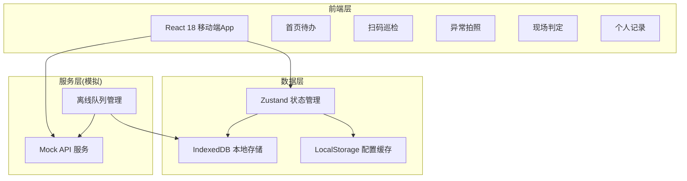
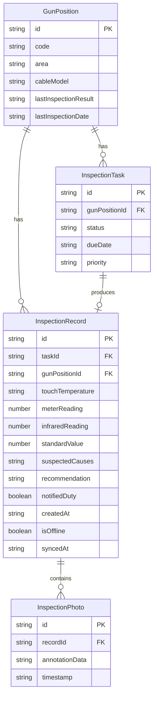

## 1. 架构设计



## 2. 技术说明

- **前端框架**：React@18 + TypeScript + Vite
- **样式方案**：TailwindCSS@3 + CSS Variables（主题色管理）
- **状态管理**：Zustand（全局状态 + 持久化中间件）
- **本地存储**：IndexedDB（巡检数据离线存储）、LocalStorage（用户配置）
- **路由方案**：React Router DOM v6
- **图标库**：lucide-react
- **初始化工具**：vite-init（react-ts 模板）
- **后端服务**：无（纯前端，使用 Mock 数据模拟）
- **数据库**：无（使用浏览器 IndexedDB + Zustand persist）

## 3. 路由定义

| 路由 | 用途 |
|------|------|
| `/` | 首页待办，展示今日任务和进度 |
| `/scan` | 扫码巡检，扫描枪位二维码 |
| `/inspect/:id` | 巡检流程，按步骤引导检查 |
| `/inspect/:id/photo` | 异常拍照，拍照标注发热点 |
| `/inspect/:id/judge` | 现场判定，录入原因和生成建议 |
| `/inspect/:id/summary` | 巡检小结，生成单次巡检摘要 |
| `/records` | 个人记录，巡检历史列表 |
| `/records/:id` | 记录详情，查看/复查历史巡检 |

## 4. API定义（模拟数据）

### 4.1 数据类型定义

```typescript
interface GunPosition {
  id: string
  code: string
  area: string
  cableModel: string
  lastInspectionResult: 'normal' | 'warning' | 'danger' | null
  lastInspectionDate: string | null
}

interface InspectionTask {
  id: string
  gunPosition: GunPosition
  status: 'pending' | 'in_progress' | 'completed'
  dueDate: string
  priority: 'normal' | 'urgent'
}

interface InspectionRecord {
  id: string
  taskId: string
  gunPosition: GunPosition
  gunHeadCheck: GunHeadCheckItem[]
  cableJointCheck: CableJointCheckItem[]
  touchTemperature: 'normal' | 'warm' | 'hot' | 'burning'
  meterReading: number | null
  infraredReading: number | null
  standardValue: number
  photos: InspectionPhoto[]
  suspectedCauses: string[]
  recommendation: 'continue' | 'monitor' | 'stop'
  notifiedDuty: boolean
  createdAt: string
  isOffline: boolean
  syncedAt: string | null
}

interface GunHeadCheckItem {
  name: string
  checked: boolean
  abnormal: boolean
}

interface CableJointCheckItem {
  name: string
  checked: boolean
  abnormal: boolean
}

interface InspectionPhoto {
  id: string
  blob: Blob
  annotations: PhotoAnnotation[]
  timestamp: string
}

interface PhotoAnnotation {
  type: 'circle' | 'arrow' | 'text'
  x: number
  y: number
  content?: string
}
```

### 4.2 模拟数据服务

使用本地 Mock 数据，通过 Zustand store 管理所有数据操作：
- `useTaskStore`：任务管理（待办列表、完成状态）
- `useInspectionStore`：巡检流程管理（步骤数据、判定结果）
- `useRecordStore`：历史记录管理（查询、复查、离线同步）
- `useAppStore`：全局应用状态（网络状态、用户信息）

## 5. 数据模型

### 5.1 数据模型定义



## 6. 离线策略

- 使用 Zustand `persist` 中间件将巡检数据存入 IndexedDB
- 拍照使用 Blob 存储，标注数据序列化保存
- 离线记录标记 `isOffline: true`，存入待同步队列
- 网络恢复时，自动触发补传流程（模拟为延时操作）
- 补传成功后更新 `syncedAt` 时间戳
